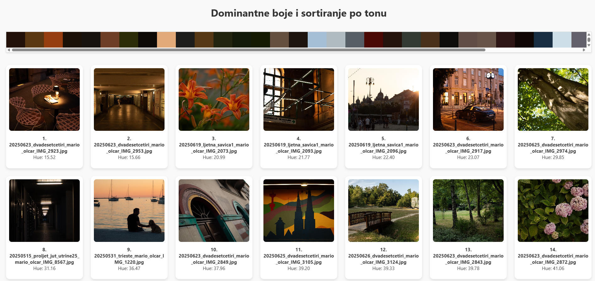

# Program za analizu fotografija po dominantnoj boji i Hue vrijednosti

Ova Python skripta automatski analizira skup slika (.jpg/.png) unutar zadane mape, detektira dominantne boje, ton i svjetlinu boje, te generira interaktivnu HTML stranicu s:

- trakom boja s HEX tooltipima
- galerijom slika sortiranim po hue vrijednosti
- klikabilnim slikama s modalnim prikazom (fullscreen + next/prev navigacija)

---

## Zahtjevi

Python 3.7+
Preporučeno virtualno okruženje (`venv`, `conda`, itd.)

---

## Instalacija biblioteka

1. Kloniraj repozitorij (ili kopiraj skriptu i `requirements.txt`)
2. Pokreni terminal i instaliraj potrebne biblioteke:

```bash
pip install -r requirements.txt
```

---

# Pokretanje skripte

1. Pokreni skriptu s ovom naredbom i zamijeni `./putanja/do/slika` s željenom putanjom do mape s .jpg ili .png fotografijama

```bash
python analiza_slika.py ./putanja/do/slika
```

---


